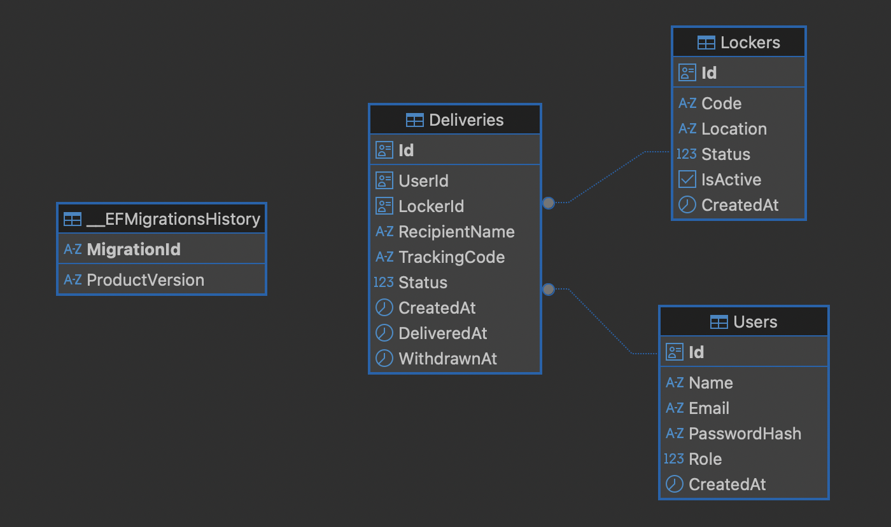

# Diagrama do Banco de Dados — PortSafe 2.0

## Visão Geral

Este documento apresenta o diagrama entidade-relacionamento (ER) do banco de dados do sistema **PortSafe 2.0**. O modelo foi gerado a partir das migrations do Entity Framework Core e representa a estrutura atual das tabelas e seus relacionamentos.

---

## Entidades

### **Users**
- **Id** (Guid): Identificador único do usuário.
- **Name** (string): Nome do usuário.
- **Email** (string): E-mail do usuário.
- **PasswordHash** (string): Hash da senha.
- **Role** (int): Papel do usuário (Admin, Porteiro, Morador).
- **CreatedAt** (datetime): Data de criação do usuário.

---

### **Lockers**
- **Id** (Guid): Identificador único do locker.
- **Code** (string): Código do locker.
- **Location** (string): Localização física.
- **Status** (int): Status do locker (Available, Occupied, Maintenance).
- **IsActive** (bool): Locker ativo/inativo.
- **CreatedAt** (datetime): Data de criação do locker.

---

### **Deliveries**
- **Id** (Guid): Identificador único da entrega.
- **UserId** (Guid): Referência ao usuário destinatário.
- **LockerId** (Guid): Referência ao locker utilizado.
- **RecipientName** (string): Nome do destinatário.
- **TrackingCode** (string): Código de rastreio.
- **Status** (int): Status da entrega (Pending, Delivered, Withdrawn, Cancelled).
- **CreatedAt** (datetime): Data de criação da entrega.
- **DeliveredAt** (datetime, opcional): Data de entrega no locker.
- **WithdrawnAt** (datetime, opcional): Data de retirada pelo destinatário.

---

## Relacionamentos

- **Deliveries.UserId → Users.Id**  
  Cada entrega pertence a um usuário.

- **Deliveries.LockerId → Lockers.Id**  
  Cada entrega utiliza um locker.

---

## Diagrama Visual

> 

---

## Observações

- O modelo pode evoluir conforme novas features forem implementadas (ex: logs, eventos, integrações IoT).
- Para alterações, atualize este documento e o diagrama sempre que houver mudanças estruturais no banco.

---

**PortSafe 2.0 — Backend**  
*Atualizado em: 30/04/2026*
