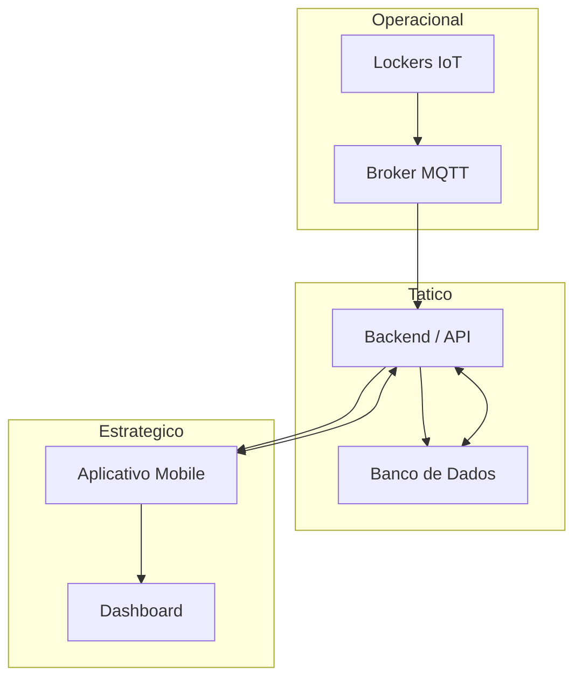

# Mapa de Integração Vertical e Horizontal — PortSafe 2.0

**Disciplina:** Integração Vertical e Horizontal  
**Projeto:** PortSafe 2.0  
**Curso:** Análise e Desenvolvimento de Sistemas  

---

## 1. Objetivo

Este documento apresenta o **mapa de integração vertical e horizontal** do sistema **PortSafe 2.0**, demonstrando como os dispositivos IoT, backend, banco de dados e aplicações se comunicam dentro da arquitetura do sistema.

---

## 2. Integração Vertical

A integração vertical representa o fluxo de dados entre os diferentes níveis do sistema.

Fluxo:
    
    Lockers IoT → Broker MQTT → Backend → Banco de Dados → Aplicativo Mobile

Nesse fluxo, os eventos físicos dos lockers são enviados ao backend, processados e disponibilizados para os usuários.

---

## 3. Integração Horizontal

A integração horizontal representa a comunicação entre sistemas no mesmo nível da arquitetura.

Exemplos:

- Backend ↔ Banco de Dados  
- Backend ↔ Cloud  
- Backend ↔ Aplicativo Mobile  

---

## 4. Diagrama de Integração

 

## 5. Explicação do Fluxo

**Operacional:**
- Os lockers IoT registram eventos físicos (abertura, fechamento) e enviam esses dados para o broker MQTT.

**Tático:**
- O backend recebe os dados, aplica regras de negócio e armazena as informações no banco de dados.

**Estratégico:**
- O aplicativo mobile e o dashboard permitem visualizar entregas, status dos lockers e informações do sistema.

## 6. Conclusão

A arquitetura do PortSafe 2.0 utiliza integração vertical para conectar dispositivos IoT ao sistema e integração horizontal para permitir comunicação entre os serviços da aplicação.

Essa estrutura permite monitoramento em tempo real, organização dos componentes e escalabilidade do sistema.